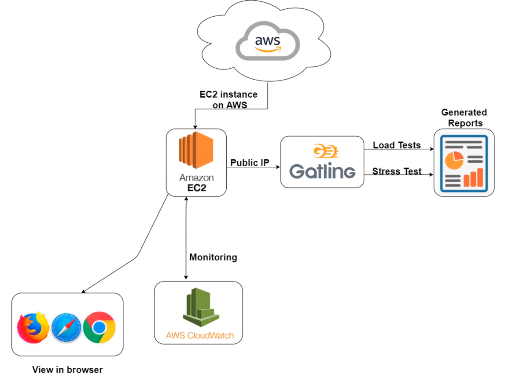
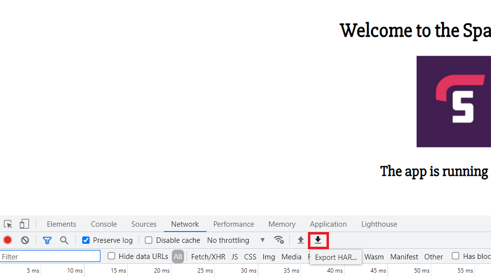
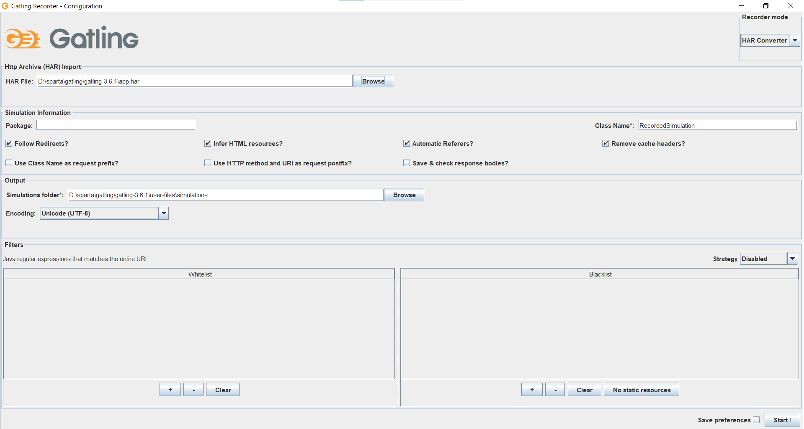
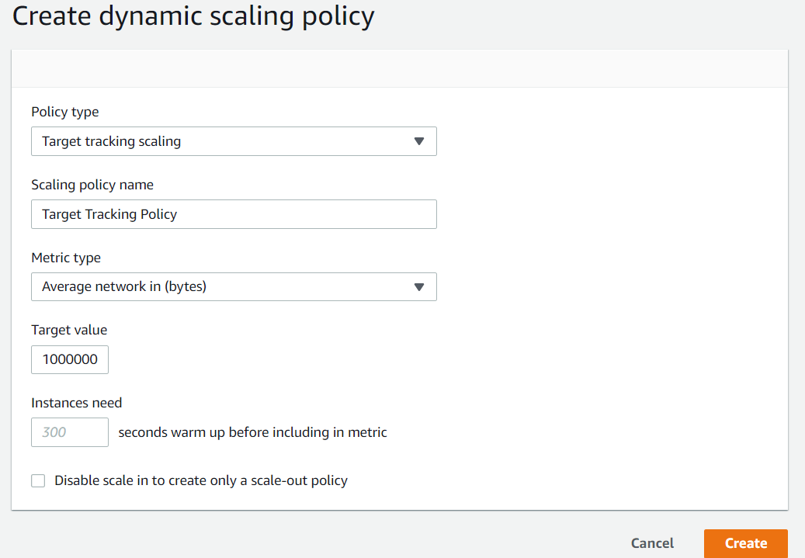
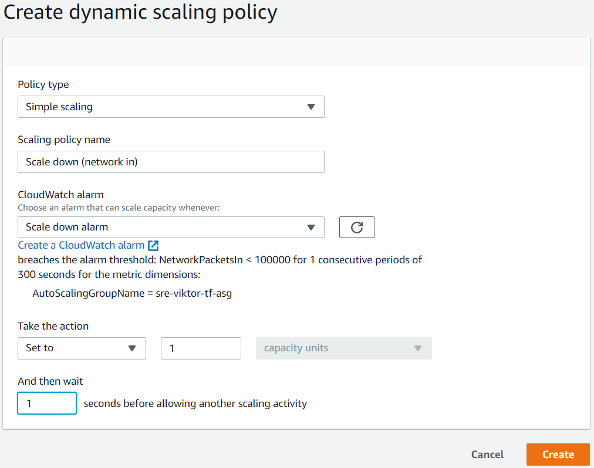
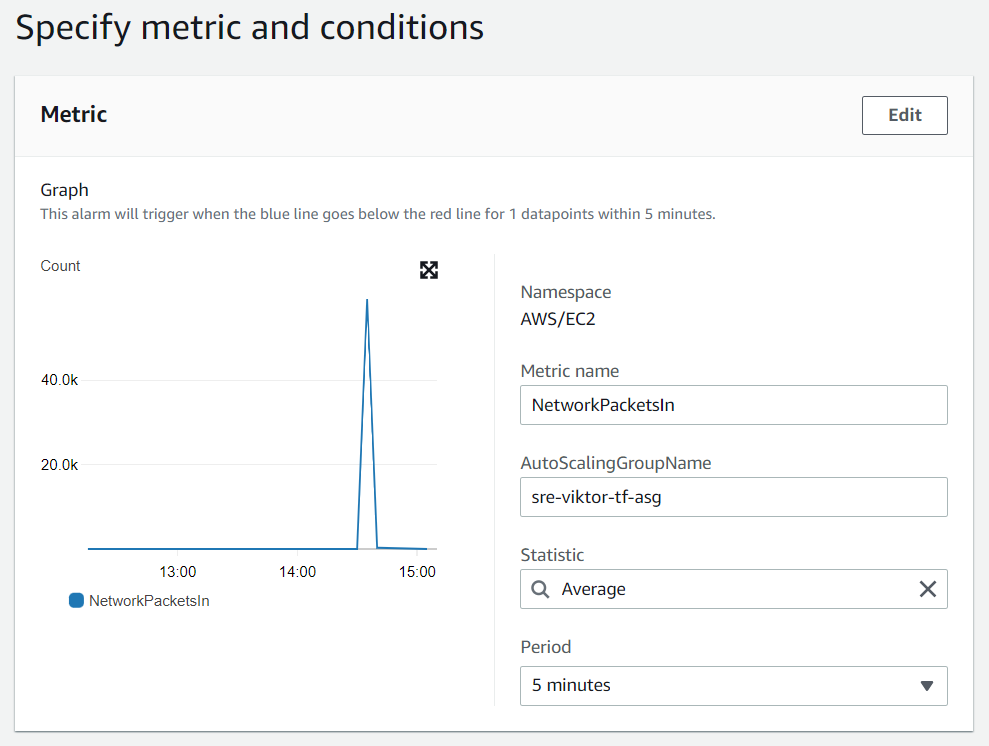
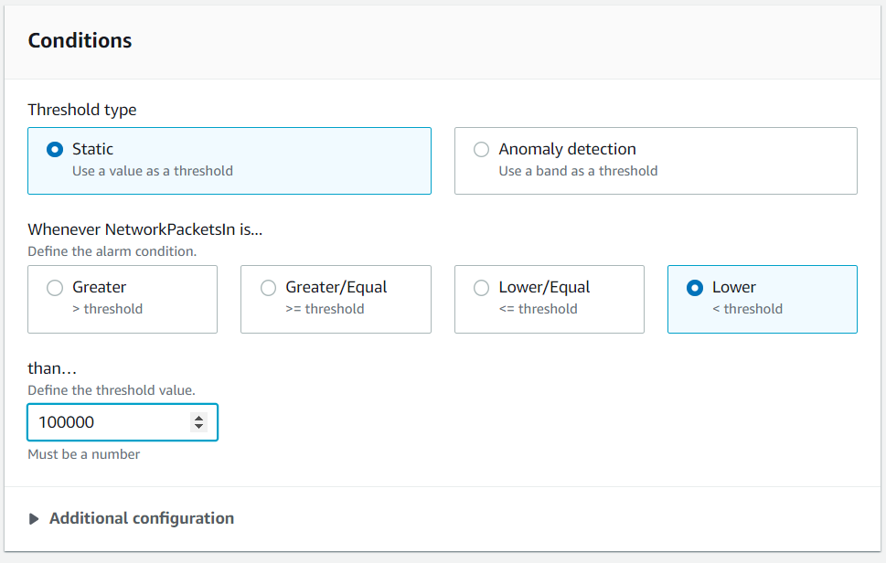
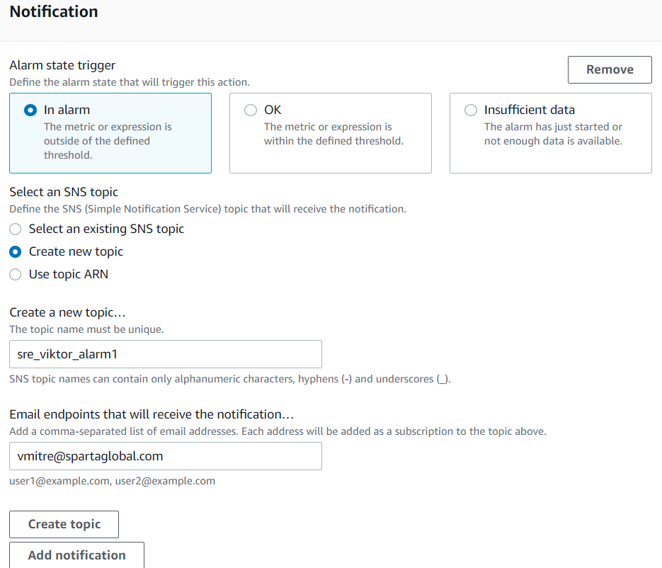
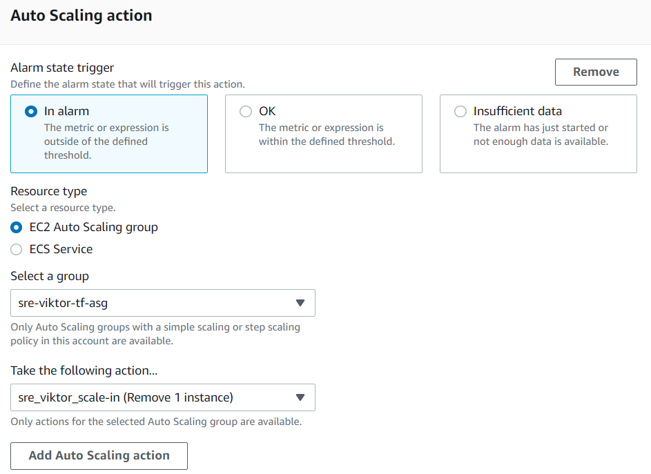
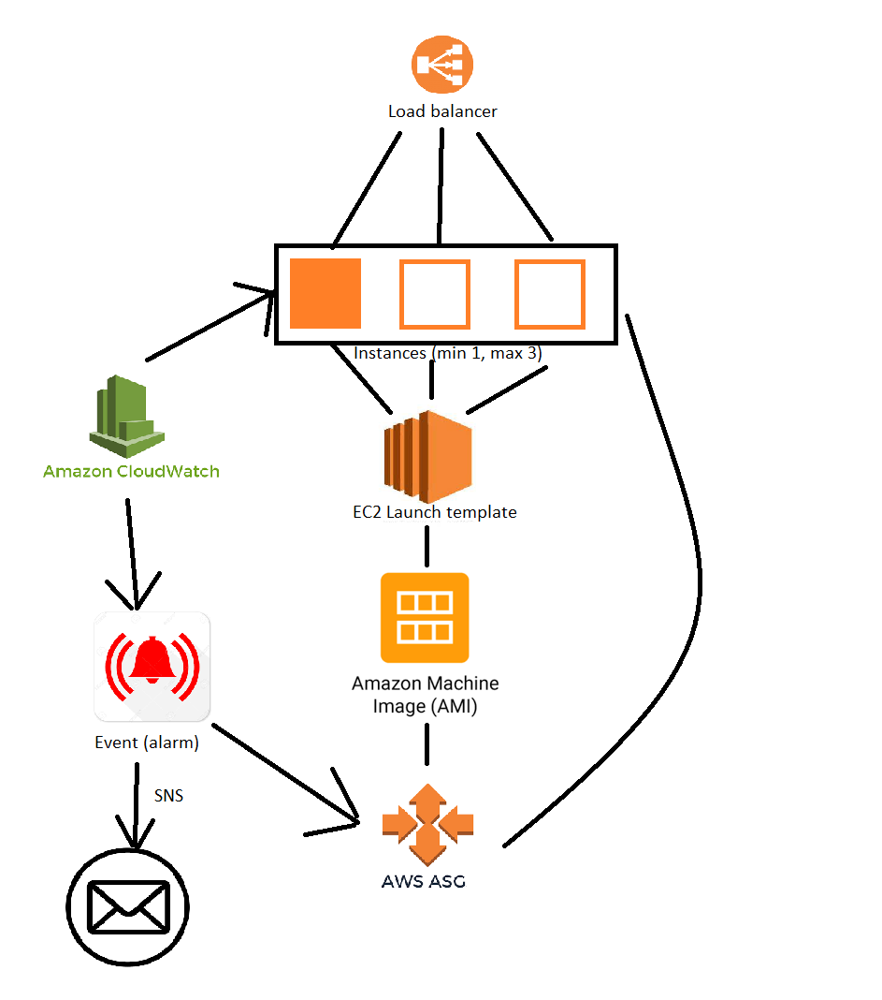

# Performance testing

## Types of testing
- Load testing 
Checking performance under a large number of virtual users
- Stress testing 
Testing how the system behaves with extreme loads
- Soak testing 
Testing with a large load over a long period of time
- Spike testing 
Testing with a sudden increase and decrease in load

## What Should be Monitored for an Internet Facing Application
- Resource Monitoring (CPU, Network, Memory, etc.)
- Network Monitoring (in and out)
- Application Performance Monitoring
- Third-party resources/components

# Steps
- Launch the app template
- Make sure auto-scaling is in place
- Record activity on the webpage with the browser
- Tick `Preserve log`
- Save activity (Export HAR)

- Convert `HAR` to `.scala` using `recorder.bat` or `recorder.sh`

- The recorded activity is now added as a test
- Run the test using `gatling.bat` or `gatling.sh` (choose the appropriate one)
- To increase the number of requests, increase the number in the last line: `setUp(scn.inject(atOnceUsers(1))).protocols(httpProtocol)` and run the test again

## Create event(s) to trigger ASG
- Select an ASG 
- On `Automatic Scaling` tab, click on `Create dynamic scaling policy`
### Example:

### Create a dynamic scaling policy to scale in

### Create an alarm for each policy (scale out and scale in)
- Select metric 
EC2 -> By Auto Scaling Group -> Select metric
- Set metric options and conditions

- Add notification

- Click on `Create a new topic` if there isn't one yet
- Name it and add an email address
- Add appropriate Auto Scaling Action

- Name it and finish creation of alarm

